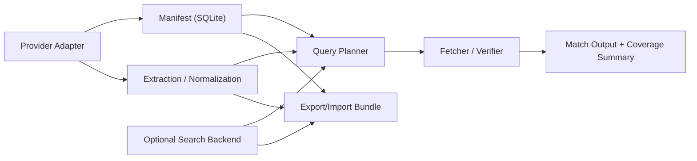
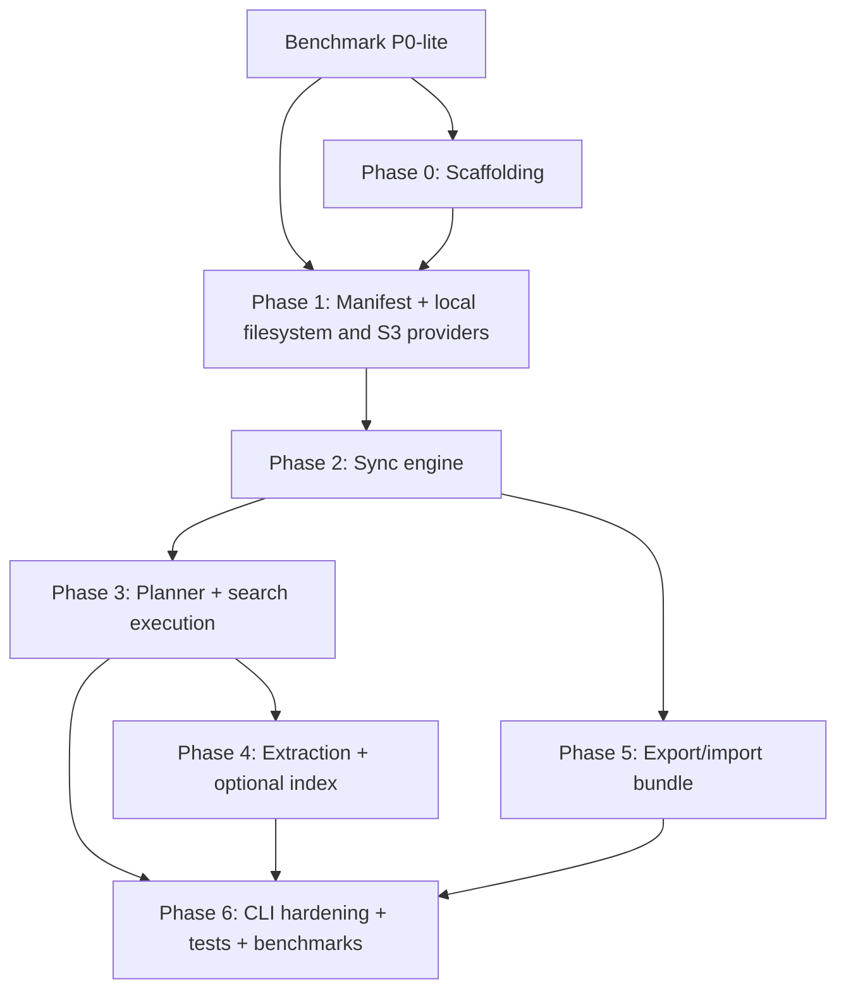

# Net-RGA Execution Plan

Status: Planning

Net-RGA is a provider-agnostic document search CLI that aims to preserve a grep-like user experience across local filesystems, object stores, and document platforms without requiring users or agents to clone an entire remote corpus. The core idea is to keep a local, queryable view of provider namespaces and canonical document representations, then fetch or verify remote content only when needed so search remains practical for large, mixed-format, network-bound corpora.

## Decision Summary

| Decision | V0 choice |
| --- | --- |
| Implementation language | Rust |
| First remote connector | S3 |
| Local filesystem support | First-class in v0 |
| CLI style | `rg`-like, but not strict drop-in compatible |
| Canonical local state | `SQLite` manifest/catalog |
| Optional local accelerators | Exportable lexical index sidecars and extracted-text cache |
| Search mode | Lexical first |
| Freshness model | Manual sync plus explicit drift/failure handling |
| Media handling in v0 | Images/videos are metadata-searchable only |
| Bundle format | Versioned bundle with `manifest.db` and optional `index/` and `cache/` |
| Search backends | Optional pluggable capability, not a v0 requirement |
| Local runtime config | `rc`-style local config for corpora, credentials references, defaults, and backend bindings |
| Results policy | Anchor-native internals with grep-like output and explicit coverage reporting |

## Problem Framing

### Why local-search assumptions break outside the local filesystem

`ripgrep` is fast because it assumes local files, cheap directory traversal, and low-latency reads. Object stores and document platforms violate those assumptions:

- Listing large namespaces is remote and expensive.
- There is no true filesystem hierarchy, only keyspaces and provider-specific metadata.
- Per-object fetch latency dominates if search naively scans remote content.
- Large mixed corpora contain formats that require extraction before content search is possible.
- Permissions, version drift, and deleted objects can invalidate cached local knowledge.

The same query model should still work across providers, but the engine cannot assume all providers expose the same internals or the same performance profile.

### Why cloning everything is not viable

For source code, cloning a repository is often cheap enough. For a `100GB+` corpus with PDFs, Office files, images, videos, archives, and logs, full local materialization is too expensive in bandwidth, storage, and startup latency. AI assistants and humans need a way to inspect and search those corpora incrementally rather than paying the full sync cost up front.

### Why `rg`-like UX still matters

AI assistants already use `rg` as a primary context-discovery tool. A provider-agnostic search system that preserves familiar query semantics, filtering, and result formats lowers both human and agent friction. The goal is not perfect flag parity; the goal is preserving the mental model:

- fast narrowing by path and type
- quick first verified hit
- easy piping and scripting
- predictable text output and machine-readable summaries

For non-code corpora, the engine should behave more like a document search system with grep-like affordances than a literal remote clone of `ripgrep`.

## Product Goals

- Deliver fast candidate pruning without touching remote content when metadata alone can rule candidates out.
- Optimize for short time-to-first-verified-match, not just total exhaustive scan completion.
- Preserve one `rg`-like query model across local filesystems, object stores, and future document platforms.
- Preserve `rg`-like query ergonomics for path filters, globs, and text matching.
- Make result coverage explicit so users can tell whether a search is complete or partial.
- Make canonical extraction and normalization first-class for non-code documents.
- Keep exact lexical search fast and predictable even when richer retrieval paths exist later.
- Support a provider model where local filesystems and `S3` are first, and additional providers fit the same abstraction.
- Allow a fresh agent/container to import a prepared corpus bundle and become productive quickly.
- Reuse proven extraction and search components where doing so avoids reimplementing commodity behavior.

## Core Principles

- Manifest-first, not scan-first.
- Query-plan before fetch.
- Verified results over guessed results.
- Canonicalize documents before treating them as searchable content.
- Treat object storage as a flat namespace, not a POSIX filesystem.
- Treat providers and search backends as separate concepts.
- Keep provider-specific behavior below the provider boundary.
- Separate canonical sync state from optional performance accelerators.
- Keep lexical verification as the source of truth even when candidate retrieval comes from an index or backend.
- Snapshot-backed local reads are useful, but live freshness must remain architecturally first-class.
- Preserve future paths for hosted indexing and semantic retrieval without shaping v0 around them.

## Desired User Outputs

The system should enable these concrete outcomes in v0:

- A user can register a provider-backed corpus and sync its namespace locally without downloading all content.
- A user can point the same tool at a local filesystem corpus and use the same query model.
- A user can run a search with `rg`-style patterns and filters and get verified matches back quickly.
- A user can see whether the search was complete, partial, or degraded by permissions, unsupported formats, or stale state.
- A user can export the local corpus state and import it into a fresh environment for faster startup.
- An agent can inspect corpus metadata, filter by path/type/time/size, and use the tool in scripts without bespoke orchestration.

## V0 Scope

### In scope

- Rust CLI application
- Local filesystem provider
- S3 provider
- Local corpus registration and config
- Local `rc`-style runtime config
- SQLite-backed manifest/catalog
- Manual sync command
- Query planner using local metadata first
- Remote fetch and verification path
- Text search for plain text and common compressed text
- Document extraction path for PDFs and Office files through adapters
- Canonical document representation and anchor model
- Optional local lexical index as a search accelerator
- Export/import bundle for manifest, index, and cache artifacts
- Coverage and failure reporting in text and JSON output

### Explicit non-goals

- Mandatory hosted backend or shared control plane
- Event-driven sync via webhooks or change streams in v0
- Live delta/change-feed implementation in v0
- OCR for images in v0
- Audio/video transcription generation in v0
- Semantic/vector search in v0
- Provider-native search integration in v0
- Broad multi-cloud connector parity in v0
- Filesystem mounting as the primary UX
- Full `rg` flag compatibility where remote semantics would be misleading

### Future extension hooks

- Additional connectors: GCS, Azure Blob, Google Drive, Dropbox, arbitrary custom connectors
- Hosted/shared search backends
- Portable/exportable lexical and vector index artifacts
- Semantic/vector retrieval
- OCR and transcription adapters
- Event-driven incremental freshness and provider delta capabilities
- Provider-native search capabilities where they exist
- Future CLI extensions such as `open`, `explain`, `delta`, `prefetch`, and `sem`
- Policy-aware or tenant-shared bundle distribution

## System Architecture

### High-level overview

Net-RGA is a hybrid local/remote document search engine:

1. A provider adapter lists, resolves, and reads local or remote documents.
2. A local manifest stores document identity, metadata, sync state, and failure markers.
3. Extraction and normalization convert supported content into canonical document representations.
4. A query planner narrows candidates using the manifest and optional search backends.
5. A fetch/verify stage retrieves only the candidates needed to prove lexical matches.
6. Results are emitted as anchor-backed snippets with grep-like rendering and explicit coverage metadata.

### Subsystem map

| Subsystem | Purpose | Inputs | Outputs | Depends on | V0 acceptance criteria |
| --- | --- | --- | --- | --- | --- |
| Corpus config | Define named corpora, provider settings, defaults, and optional backend bindings | CLI input, local config, auth hints | Resolved corpus definition | None | Can register/list/remove corpora and persist provider/config settings |
| Provider adapter | Normalize local and remote content access | Corpus config, auth, prefixes, document ids | Namespace pages, metadata, byte streams, resolved targets | Corpus config | Local filesystem and S3 support required list/stat/read/resolve with surfaced provider errors |
| Manifest/catalog | Canonical local state for namespace and sync health | Provider output, sync checkpoints, extraction/index status | Queryable document metadata and local state | Provider adapter | Stores identity, metadata, tombstones, sync markers, extraction/index state, and failure status |
| Extraction/normalization | Convert provider bytes into canonical document IR | Metadata, sniffed bytes, object stream | Normalized text, anchors, snippets, extraction metadata | Provider adapter | Supports plain text, compressed text, PDF, and Office docs through reusable components |
| Query planner | Convert a search request into an execution plan | User query, globs, filters, manifest, optional backend hints | Candidate set and execution strategy | Manifest, optional search backend | Can prune by path/type/size/time and choose manifest-only, backend-assisted, or fetch/verify paths |
| Search backend | Optionally accelerate lexical or future semantic candidate selection | Canonical document ids, normalized text, query constraints | Candidate documents/anchors/snippets | Extraction, manifest | Optional and removable; absence does not prevent search |
| Fetch/verify engine | Retrieve content and prove lexical matches | Candidate list, provider adapter, extraction strategy | Verified matches and coverage counters | Provider adapter, planner, extraction | Can verify text matches against source content and account for failures and unsupported objects |
| Bundle exporter/importer | Move prepared corpus state across environments | Manifest, optional index/cache, metadata | Versioned portable bundle | Manifest, search backend artifacts, cache | Fresh environment can import a bundle and search immediately without mandatory rebuild |
| Output/reporting | Present match results and coverage truthfully | Verified matches, anchors, snippets, coverage stats, errors | Text output, JSON summary, exit status | Fetch/verify engine | Emits stable machine-readable coverage data and differentiates complete vs partial search |

### Dependency chart



## Canonical Document Representation

Net-RGA should search canonical document representations, not only raw provider bytes. This is especially important for PDFs, presentations, spreadsheets, word processing files, and future document-platform-native content where extraction and normalization dominate search quality.

### Canonical document IR

The canonical document representation should be the shared internal unit for:

- lexical search
- snippet generation
- result rendering
- optional backend indexing
- future semantic retrieval

It should represent normalized text plus enough structure to map matches back to user-meaningful locations.

### Anchors

An anchor is a provider/document-relative location reference. Depending on content type, an anchor may point to:

- file path and line-like span
- PDF page and text span
- slide number and text region
- sheet name and cell range
- chunk id and byte/text span

Plain text files can map naturally to line-like anchors. Rich documents should not be forced into a fake line model internally.

### Result model

The canonical internal match should be:

- document id
- anchor
- snippet
- verification metadata

The CLI should render those matches in a grep-like format whenever possible, while preserving richer anchor semantics in JSON output.

## Public Interfaces

### CLI surface

The CLI should be explicit about corpus management and search while preserving familiar search flags.

| Command | Purpose | Output |
| --- | --- | --- |
| `net-rga corpus add <name> ...` | Register a corpus and provider config | Corpus record confirmation |
| `net-rga corpus remove <name>` | Remove corpus registration and optionally local state | Removal summary |
| `net-rga corpus list` | Show configured corpora | Table or JSON |
| `net-rga sync <corpus>` | Refresh local manifest from remote namespace | Sync summary and drift/failure stats |
| `net-rga search [flags] <pattern> <corpus>` | Execute lexical search | Match output plus summary |
| `net-rga inspect <corpus>` | Show corpus health, last sync, and local artifact status | Human and JSON summary |
| `net-rga export <corpus> <bundle>` | Export portable bundle | Bundle manifest summary |
| `net-rga import <bundle>` | Import a portable bundle | Imported corpus summary |

Future, non-v0 CLI extensions may include `open`, `explain`, `delta`, `prefetch`, and `sem`, but they are not part of the initial implementation plan.

### Search flags

V0 should support the subset of `rg`-style behavior that maps cleanly to local and provider-backed document search:

- pattern argument
- fixed-string and regex search
- path globs
- include/exclude behavior
- file-type and extension filters
- limit/early-stop controls
- JSON output mode
- context lines only where remote extraction makes it reliable

V0 should not claim support for flags that assume direct filesystem semantics or complete local file materialization.

### Provider capability model

Providers should expose a small required core contract and may later expose optional capabilities. The baseline contract is intentionally minimal.

```rust
trait Provider {
    fn list(&self, prefix: &str, cursor: Option<String>) -> Result<ListPage>;
    fn stat(&self, document_id: &DocumentId) -> Result<DocumentMeta>;
    fn read(&self, document_id: &DocumentId, range: Option<ByteRange>) -> Result<ByteStream>;
    fn resolve(&self, locator: &DocumentLocator) -> Result<ResolvedDocument>;
}
```

Core provider responsibilities:

- expose provider-native document identity
- surface version markers such as `etag`, revision, or generation where available
- distinguish not found, permission denied, throttling, and transient network failures
- avoid leaking provider-specific pagination behavior into higher layers

Optional future provider capabilities should be documented as extensions rather than v0 requirements:

- `delta`
- `permissions`
- `open_url`
- provider-native `search`

### Search backend contract

Search backends are separate from providers. A provider may have a configured backend, but the provider adapter does not own the search abstraction.

```rust
trait SearchBackend {
    fn query(&self, request: &SearchRequest) -> Result<Vec<CandidateMatch>>;
}
```

Search backend responsibilities:

- accept canonical document ids, anchors, and query constraints
- return candidate documents, anchors, or snippets
- remain optional and pluggable
- never replace final lexical verification as the source of truth

### Extractor contract

Extractors are format-specific adapters selected by object metadata and initial byte sniffing.

```rust
trait Extractor {
    fn can_handle(&self, meta: &ObjectMeta, sniff: &[u8]) -> bool;
    fn extract(&self, input: ByteStream, meta: &ObjectMeta) -> Result<ExtractedText>;
}
```

Extractor output must include:

- normalized text
- anchor metadata
- content kind
- extraction warnings
- unsupported reason when extraction is not available

### Configuration model

V0 should define a local `rc`-style configuration artifact for:

- corpus definitions
- provider credentials references
- local defaults
- output preferences
- optional search backend bindings

The plan should not over-specify the concrete file format yet beyond requiring a local config artifact that can be round-tripped and versioned if needed.

### Result and summary semantics

Human-readable output should stay close to `rg` conventions for matches. Internally, matches are anchor-backed snippets. JSON output must include enough data for agents to reason about search completeness and anchor locations.

Minimum summary fields:

- corpus name
- query
- total candidates considered
- indexed candidates
- fetched candidates
- verified matches
- unsupported objects
- deleted/stale objects
- permission-denied objects
- other fetch/extraction failures
- coverage status: `complete` or `partial`

Minimum per-match machine-readable fields:

- document id
- anchor
- snippet
- verification status

## Artifact Model

### Local corpus layout

Each corpus should be representable by a stable local directory layout:

- `config` local corpus/runtime config reference
- `manifest.db`
- `index/` optional lexical or future vector index data
- `cache/` optional extracted-text or fetched-content cache
- `bundle.json` metadata when exported

### `manifest.db`

`manifest.db` is the source of truth for:

- corpus identity and connector metadata
- object records
- normalized path and key metadata
- version markers
- sync checkpoints and sync history
- tombstones for deleted objects
- canonical document metadata and anchor-related state
- extraction/index/cache status
- failure records and last-seen errors

### Optional sidecars and backend artifacts

- `index/` stores lexical index segments. Planned backend: `tantivy`.
- `cache/` stores extracted text or reusable intermediate artifacts when beneficial.

The same bundle model should be able to grow to include portable backend artifacts later without changing the role of `manifest.db` as the canonical sync record.

The manifest must remain valid and useful even when neither sidecar exists.

### Bundle format

Bundles are versioned and portable. A bundle contains:

- `bundle.json` with schema version, corpus metadata, and artifact inventory
- `manifest.db`
- optional `index/`
- optional `cache/`

Import requirements:

- version check before import
- graceful degradation if optional artifacts are missing
- preserved corpus identity and last-sync metadata

## Coverage Semantics

Coverage semantics are mandatory because remote search can be materially incomplete for legitimate reasons.

### `complete`

A search is `complete` when:

- every candidate object selected by the planner was either fully searched or conclusively ruled out
- no candidate was skipped due to stale manifest uncertainty, permission failures, extractor absence, or transient connector failures

### `partial`

A search is `partial` when any candidate subset could not be fully resolved due to:

- permission denied
- object deleted or changed since manifest snapshot
- transient connector/read failures
- unsupported extraction format within the searched scope
- explicit user stop/limit before full coverage
- missing local accelerators only if they caused fallback work to be skipped rather than performed

### Coverage reporting rules

- Human-readable output should include a short summary line when results are partial.
- JSON output must include counters for skipped/unsupported/deleted/denied/stale/error categories.
- Match output remains verified only; the tool never reports unverified speculative hits.
- Internal results should still preserve anchor and snippet structure even when rendered in a grep-like format.
- Exit behavior should distinguish:
  - match found
  - no match found with complete coverage
  - no match found with partial coverage

## Technology Choices For V0

These choices are part of the plan so implementation can start without reopening basic stack decisions.

| Concern | Choice | Reason |
| --- | --- | --- |
| CLI parsing | `clap` | Mature Rust CLI ergonomics |
| Async runtime | `tokio` | Needed for provider I/O and concurrent fetch paths |
| S3 client | `aws-sdk-s3` | First-party Rust SDK and future auth flexibility |
| SQLite access | `rusqlite` | Good fit for SQLite-first local state without forcing external DB assumptions |
| Serialization/config | `serde` + `toml` or `yaml` | Straightforward local config and bundle manifest handling |
| Lexical index | `tantivy` | Established Rust full-text index for optional local sidecar acceleration |
| Compression/text detection | Existing Rust crates plus shell-safe adapters where needed | Reuse commodity functionality |
| PDF/Office extraction | Adapter strategy around proven libraries or tools | Avoid reimplementing document parsing |

## Implementation Order

Implementation should proceed strictly in phase order. Search must not be built before the manifest and sync model exist, and early engine work must have a thin benchmark scaffold in place so correctness and latency regressions are visible from the beginning.

### Phase dependency DAG



### Benchmark P0-lite: Benchmark scaffold before full engine work

Goal: establish the smallest benchmark foundation needed to protect early implementation work without spending time on the full benchmark suite up front.

Dependencies:

- none

Deliverables:

- benchmark case schema
- judgment schema
- machine-readable benchmark output schema
- tiny deterministic Tier 0 corpus
- first golden query set
- minimal harness for local execution

Acceptance criteria:

- The harness can run a tiny corpus end to end and emit stable per-query and aggregate results
- The benchmark can record at least latency, provider-op counts, exact match correctness, anchor/snippet correctness, and coverage correctness
- The benchmark scaffold is usable in CI without requiring a cloud dependency

Open risks:

- Spending too much time designing the full benchmark program before core search exists
- Locking the harness too tightly to placeholder interfaces

Checklist:

- [ ] Define benchmark case schema for query, run mode, and expected result references
- [ ] Define judgment schema for relevant documents, acceptable anchors, and coverage expectations
- [ ] Define machine-readable outputs for latency, cost counters, correctness, and coverage
- [ ] Create a tiny deterministic golden corpus for local filesystem runs
- [ ] Add 5-10 golden scenarios covering exact match, path filter, unsupported file, and partial coverage cases
- [ ] Build a minimal local harness that can compare revisions on the golden corpus
- [ ] Wire the benchmark scaffold into fast local/CI execution

### Phase 0: Scaffolding

Goal: establish the repo, crate boundaries, and core types so later work does not force structural churn.

Dependencies:

- Benchmark P0-lite

Deliverables:

- Rust workspace layout
- CLI crate and library crate boundaries
- core domain types for corpus, document metadata, anchors, search requests, and coverage summaries
- provider capability definitions
- search backend capability definitions
- config/rc file model

Acceptance criteria:

- Project builds with placeholder implementations
- Core interfaces compile cleanly
- Config can round-trip through serialization
- Document-anchor types are usable without locking the CLI into snippet-first UX

Open risks:

- Over-designing crate boundaries too early
- Locking into async/sync boundaries that make provider work awkward

Checklist:

- [ ] Initialize Cargo workspace
- [ ] Add base crates and lint/test scaffolding
- [ ] Define domain models for corpus, document identity, metadata, anchors, and search summary
- [ ] Define provider, optional capability, search backend, and extractor traits
- [ ] Define config schema and local state directory conventions
- [ ] Add a thin CLI shell with subcommand placeholders

### Phase 1: SQLite schema, corpus registration, local filesystem and S3 providers

Goal: create the persistent local state and first real providers.

Dependencies:

- Phase 0
- Benchmark P0-lite

Deliverables:

- SQLite schema migration strategy
- corpus registration flow
- local filesystem provider
- S3 auth/config handling
- working provider implementations for list/stat/read/resolve

Acceptance criteria:

- Can register local filesystem and S3 corpora and persist them locally
- Can open the manifest and store corpus metadata
- Local filesystem and S3 providers can list a prefix, stat a document, resolve a locator, and read content

Open risks:

- Auth complexity across local credentials, env vars, and profiles
- Provider-specific edge cases in pagination and version markers

Checklist:

- [ ] Create manifest schema for corpora, objects, sync checkpoints, tombstones, and failure records
- [ ] Add migration runner for `manifest.db`
- [ ] Implement corpus add/list/remove commands
- [ ] Implement local filesystem provider
- [ ] Implement S3 connector config and auth resolution
- [ ] Implement S3 list/stat/read/resolve primitives
- [ ] Add provider integration tests for local filesystem and an S3-compatible target

### Phase 2: Sync engine and manifest reconciliation

Goal: materialize remote namespace state locally and handle drift cleanly.

Dependencies:

- Phase 1

Deliverables:

- sync command
- pagination-aware object ingestion
- manifest reconciliation logic
- tombstone handling
- sync summary reporting

Acceptance criteria:

- Repeated sync updates existing object state instead of duplicating records
- Deleted objects are tracked as tombstones
- Permission and transient failures are recorded without corrupting the manifest

Open risks:

- Large listings stressing transaction size and sync runtime
- Ambiguous treatment of objects missing during partial or failed syncs

Checklist:

- [ ] Implement sync orchestration and checkpoint persistence
- [ ] Upsert object metadata and version markers into the manifest
- [ ] Mark deleted objects as tombstoned when reconciliation proves absence
- [ ] Record sync errors, permission failures, and transient failures
- [ ] Add sync summary with counts for new, updated, deleted, denied, and failed objects
- [ ] Add integration tests for repeated sync, deletion, and RBAC drift across local and S3 providers

### Phase 3: Planner, candidate pruning, fetch/verify execution, result output

Goal: deliver the first usable remote search path before optional indexing work.

Dependencies:

- Phase 2

Deliverables:

- search command
- metadata-based candidate pruning
- ranked execution plan
- fetch/verify engine
- human-readable and JSON result summaries

Acceptance criteria:

- Can run a search over a synced corpus and return verified matches
- Planner can prune by path, extension, type, size, and time
- Output clearly reports complete versus partial coverage
- Internal results preserve document anchors and snippets while CLI output remains grep-like

Open risks:

- Poor first-hit latency before indexing exists
- Overfetch if planner heuristics are weak

Checklist:

- [ ] Define search request model and output schema
- [ ] Implement manifest-side filtering for globs and metadata predicates
- [ ] Implement candidate ranking for small, recent, and likely-relevant objects
- [ ] Implement remote fetch and text verification path
- [ ] Implement grep-like rendering over anchor-backed internal results
- [ ] Emit stable text and JSON summaries with coverage fields
- [ ] Define exit-code behavior for match/no-match/partial cases

### Phase 4: Extraction adapters and optional lexical index

Goal: support document-heavy corpora and improve interactive performance.

Dependencies:

- Phase 3

Deliverables:

- extractor selection logic
- canonical document IR and anchor generation
- plain-text and compressed-text support
- PDF and Office extraction adapters
- optional `tantivy` lexical index integration

Acceptance criteria:

- Supported document formats can produce searchable normalized text
- Unsupported formats are surfaced explicitly without breaking search
- Index can accelerate candidate selection but is not required for correctness

Open risks:

- Extraction toolchain complexity across environments
- Index invalidation when source objects change

Checklist:

- [ ] Implement content sniffing and extractor dispatch
- [ ] Define canonical document IR and anchor serialization
- [ ] Implement plain-text and compressed-text extraction
- [ ] Integrate PDF extraction adapter
- [ ] Integrate Office extraction adapter
- [ ] Define index schema and index update strategy
- [ ] Use index hits as planner input without bypassing final verification

### Phase 5: Export/import bundle

Goal: support portable corpus bootstrap for fresh environments and agents.

Dependencies:

- Phase 2 for manifest portability
- Phase 4 if index/cache artifacts are included

Deliverables:

- export command
- import command
- bundle manifest format
- artifact versioning rules

Acceptance criteria:

- Fresh environment can import a bundle and inspect/search the corpus immediately
- Missing optional artifacts degrade gracefully
- Bundle version mismatch is detected and reported clearly

Open risks:

- Cross-machine path assumptions leaking into bundle contents
- Large bundle sizes if caches grow without policy

Checklist:

- [ ] Define `bundle.json` schema and versioning
- [ ] Implement bundle pack/unpack workflow
- [ ] Preserve corpus metadata and sync state across import/export
- [ ] Allow import without optional `index/` or `cache/`
- [ ] Add tests for clean-environment restore

### Phase 6: CLI hardening, test matrix, benchmarks, docs updates

Goal: stabilize behavior and prove the tool is usable beyond happy paths.

Dependencies:

- Phases 3, 4, and 5

Deliverables:

- expanded automated test coverage
- expanded benchmark suite and baseline numbers
- CLI UX cleanup
- updated user-facing docs

Acceptance criteria:

- Key workflows are covered by automated tests
- Benchmark runs produce repeatable baseline metrics
- Output and error messages are fit for human and agent consumption

Open risks:

- Benchmark instability in networked test setups
- UX churn if result semantics are not locked early

Checklist:

- [ ] Add unit tests for planner, manifest reconciliation, coverage accounting, and bundle metadata
- [ ] Add integration tests against local filesystem and S3-compatible storage
- [ ] Add CLI snapshot tests for text and JSON output
- [ ] Expand the benchmark scaffold into mixed-format, provider-matrix, and freshness benchmark runs
- [ ] Refresh `README.md` once implementation exists
- [ ] Document known limitations and deferred features

## Testing And Validation Strategy

### Benchmark-first validation slice

Before major engine work proceeds, the project should complete the thin benchmark scaffold defined in [BENCHMARK_PLAN.md](/Users/harshit/Desktop/net-rga/BENCHMARK_PLAN.md). This is intentionally smaller than the full benchmark program.

The required first slice is:

- benchmark case schema
- judgment schema
- machine-readable result schema
- tiny deterministic Tier 0 corpus
- 5-10 golden scenarios
- minimal local harness

This slice exists to establish:

- a stable notion of correctness for exact search behavior
- baseline timing and cost counters for early implementations
- regression checks for anchor/snippet rendering and coverage truthfulness

The full benchmark suite remains later work. The project should not block on building the entire benchmark program before implementing providers, manifest sync, and the first search path.

### Required test classes

- Unit tests for domain logic, manifest operations, planner filtering, coverage accounting, and bundle metadata
- Integration tests using the local filesystem and an S3-compatible target such as `MinIO` or `LocalStack`
- CLI tests covering command behavior and JSON shape stability
- Performance sanity checks for sync throughput and time-to-first-match
- Golden benchmark runs from the benchmark scaffold for exact correctness and early latency/cost baselines

### Required scenarios

- fresh sync into an empty manifest
- repeated sync with no changes
- object update with changed version marker
- object deletion and tombstone creation
- permission denied on previously visible objects
- stale manifest where object changed or disappeared before fetch
- search over a local filesystem corpus using the same query model
- search over plain text
- search over supported extracted documents
- search over unsupported media formats
- export/import into a clean environment

### Validation bar

The tool is ready for v0 only when:

- the benchmark scaffold exists and protects core correctness/latency regressions
- manifest sync is reliable enough to trust as the local source of truth
- verified search works without requiring the lexical index
- partial coverage is surfaced clearly and consistently
- imported bundles are immediately usable

## Risks And Decision Log

### Freshness and trust

Risk: stale local state can produce misleading confidence.

Decision: favor explicit partial-coverage reporting over pretending searches are exhaustive.

### Extraction breadth

Risk: broad format support creates dependency sprawl.

Decision: reuse proven adapters and keep unsupported formats explicit rather than silently ignored.

### Performance before indexing

Risk: planner-only search may feel slow on document-heavy corpora.

Decision: deliver planner plus verification first, then add optional lexical index as the main accelerator.

### Connector abstraction drift

Risk: abstractions shaped too tightly around S3 may not fit other providers.

Decision: keep the provider contract minimal and centered on universally available primitives.

### Provider vs backend confusion

Risk: provider-native search and third-party search backends could blur responsibilities.

Decision: keep providers focused on content and metadata access, and model search backends as separate optional capabilities that may be configured against a corpus.

## Immediate Next Actions

These are the first implementation tasks after this plan lands:

1. Implement the benchmark P0-lite scaffold from [BENCHMARK_PLAN.md](/Users/harshit/Desktop/net-rga/BENCHMARK_PLAN.md): schemas, tiny corpus, golden scenarios, and minimal harness.
2. Bootstrap the Rust workspace with a CLI crate and a core library crate.
3. Define core domain models plus provider, backend, anchor, and extractor traits.
4. Implement the local config model, `manifest.db` schema, and local state directory conventions.
5. Add local filesystem and S3 providers with integration test infrastructure.
6. Build sync before search so the planner has a stable manifest to operate on.

## Definition Of Done For `PLAN.md`

This document is considered sufficient when:

- it can be handed to another engineer or agent without requiring prior chat context
- v0 commitments are clearly separated from future hooks and non-goals
- every major subsystem lists its role, interfaces, dependencies, and acceptance bar
- phase checklists are concrete enough to execute directly
